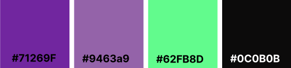

   
  
  # Hamburgreen: sua eco-hamburgueria predileta
  
  

  
  
  
  
   
   
  

   
  
  **Status do Projeto:** _Em andamento_ 
  <!--
  Confira o resultado do projeto [aqui]() ou no QR code a seguir:

     
  -->

## Índice

* [1. Resumo do projeto](#1-resumo-do-projeto)
* [2. Definição de produto](#2-definição-de-produto)
* [3. Histórias de usuário](#3-histórias-de-usuário)
* [4. Desenho da Interface de Usuário](#4-desenho-da-interface-de-usuário)  
  * [4.1 Protótipos de alta fidelidade](#41-protótipos-de-alta-fidelidade)
  * [4.2 Paleta de Cores](#42-paleta-de-cores)
* [5. Testes manuais e de usabilidade](#5-testes-manuais-e-de-usabilidade)
* [6. Considerações Técnicas](#6-considerações-técnicas)
  * [6.1 Boilerplate](#61-boilerplate)
  * [6.2 Planejamento](#62-planejamento)
  * [6.3 Ferramentas utilizadas](#63-ferramentas-utilizadas)
  * [6.4 Tech Skills](#64-tech-skills)
  * [6.5 Objetivos de aprendizagem](#65-objetivos-de-aprendizagem)
  
***

## 1. Resumo do projeto

O projeto Burguer Queen foi o quarto projeto desenvolvido no bootcamp da [Laboratoria](https://www.laboratoria.la/br). O seu principal objetivo era  aprender a construir uma <i>interface web</i> usando o <i>framework</i> React. Dessa forma, deveria-se desenvolver uma interface para uma hamburgueria, com o objetivo de realizar pedidos utilizando um tablet, e enviá-los para a cozinha para que sejam preparados de forma ordenada e eficiente. O projeto deveria ter duas áreas: interface (cliente) e API (servidor), de modo que a interface se integrasse com a API. 
<!-- colocar aqui um resumo do que foi mais aprendido durante o projeto -->

A partir disso, desenvolveu-se uma interface web para a Hamburgreen: a sua eco-hamburgueria predileta. A Hamburgreen é uma hamburgueria 100% eco-friendly pensada na sustentabilidade do planeta e construída para fazer não somente o seu cliente feliz, mas a natureza também. Ela utiliza energias renováveis de usinas solares e de biogás do Piauí; todos os seus materiais são recicláveis e todo o lixo gerado é descartado de acordo com as normas de reciclagem. 

## 2. Definição de produto

Hamburgreen: a sua eco-hamburgueria predileta. A Hamburgreen é uma hamburgueria 100% eco-friendly pensada na sustentabilidade do planeta e construída para fazer não somente o seu cliente feliz, mas a natureza também. Ela utiliza energias renováveis de usinas solares e de biogás do Piauí; todos os seus materiais são recicláveis e todo o lixo gerado é descartado de acordo com as normas de reciclagem. 

## 3. Histórias de Usuário

#### [História de usuário 1] Garçom/Garçonete deve poder entrar no sistema

> <i>"Eu, como garçom/garçonete quero entrar no sistema de pedidos."</i>

##### Critérios de aceitação

O que deve acontecer para satisfazer as necessidades do usuário?

* Acessar uma tela de login.
* Inserir email e senha.
* Receber mensagens de erros compreensíveis, conforme o erro e as informações inseridas.
* Entrar no sistema de pedidos caso as credenciais forem corretas.

##### Definição de pronto

O acordado abaixo deve acontecer para dizer que a história está terminada:

* Você deve ter recebido _code review_ de pelo menos uma parceira.
* Fez _testes_ unitários e, além disso, testou seu produto manualmente.
* Você fez _testes_ de usabilidade e incorporou o _feedback_ do usuário.
* Você deu deploy de seu aplicativo e marcou sua versão (tag git).

***

#### [História de usuário 2] Garçom/Garçonete deve ser capaz de anotar o pedido do cliente

> <i>"Eu como garçom/garçonete quero poder anotar o pedido de um cliente para não
depender da minha memória, saber quanto cobrar e poder enviar os pedidos para a
cozinha para serem preparados em ordem."</i>

##### Critérios de aceitação

O que deve acontecer para satisfazer as necessidades do usuário?

* Anotar o nome do cliente.
* Adicionar produtos aos pedidos.
* Excluir produtos.
* Ver resumo e o total da compra.
* Enviar o pedido para a cozinha (guardar em algum banco de dados).
* Funcionar bem em um _tablet_.

##### Definição de pronto

O acordado abaixo deve acontecer para dizer que a história está terminada:

* Você deve ter recebido _code review_ de pelo menos uma parceira.
* Fez _testes_ unitários e, além disso, testou seu produto manualmente.
* Você fez _testes_ de usabilidade e incorporou o _feedback_ do usuário.
* Você deu deploy de seu aplicativo e marcou sua versão (tag git).

***

#### [História de usuário 3] Chefe de cozinha deve ver os pedidos

> <i>"Eu como chefe de cozinha quero ver os pedidos dos clientes em ordem, poder
marcar que estão prontos e poder notificar os garçons/garçonetes que o pedido
está pronto para ser entregue ao cliente."</i>

##### Critérios de aceitação

* Ver os pedidos ordenados à medida em que são feitos.
* Marcar os pedidos que foram preparados e estão prontos para serem servidos.
* Ver o tempo que levou para preparar o pedido desde que chegou, até ser marcado
  como concluído.

##### Definição de pronto

* Você deve ter recebido _code review_ de pelo menos uma parceira.
* Fez _testes_ unitários e, além disso, testou seu produto manualmente.
* Você fez _testes_ de usabilidade e incorporou o _feedback_ do usuário.
* Você deu deploy de seu aplicativo e marcou sua versão (tag git).

***

#### [História de usuário 4] Garçom/Garçonete deve ver os pedidos prontos para servir

> <i>"Eu como garçom/garçonete quero ver os pedidos que estão prontos para entregá-los
rapidamente aos clientes."</i>

##### Critérios de aceitação

* Ver a lista de pedidos prontos para servir.
* Marcar os pedidos que foram entregues.

##### Definição de pronto

* Você deve ter recebido _code review_ de pelo menos uma parceira.
* Fez _testes_ unitários e, além disso, testou seu produto manualmente.
* Você fez _testes_ de usabilidade e incorporou o _feedback_ do usuário.
* Você deu deploy de seu aplicativo e marcou sua versão (tag git).
* Os dados devem ser mantidos intactos, mesmo depois que um pedido for
  finalizado. Tudo isso para poder ter estatísticas no futuro.

***

## 4. Desenho da Interface de Usuário

### 4.1 Protótipos de alta fidelidade

O protótipo de alta fidelidade foi construído utilizando a ferramenta Figma. Você pode conferí-lo inteiramente [aqui](https://www.figma.com/proto/DcySoXGhWAKQHVPEA2hLVY/Burguer-Queen?node-id=23%3A5&scaling=scale-down&page-id=23%3A4&starting-point-node-id=23%3A5).

### 4.2 Paleta de cores

#### Feedbacks:

Na elaboração do protótipo, foram realizados algumas alterações e incorporações após receber feedbacks de melhoria de usuários. Dentre elas, estão:

- Aumentar o tamanho dos botões;
- Trocar a cor de fundo para um preto que não seja a cor pura, para evitar cansar a vista do usuário;
- Mudança na ordem de apresentação dos pedidos da cozinha para que fique mais intuitiva;

## 5. Testes manuais e de usabilidade
## 6. Considerações Técnicas
### 6.1 Boilerplate
### 6.2 Planejamento
                                                   
                                                   
### 6.3 Ferramentas utilizadas
### 6.4 Tech Skills
### 6.5 Objetivos de aprendizagem

