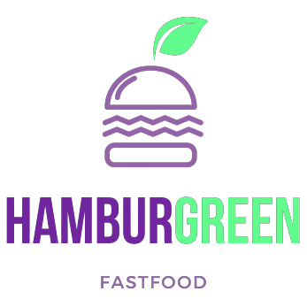
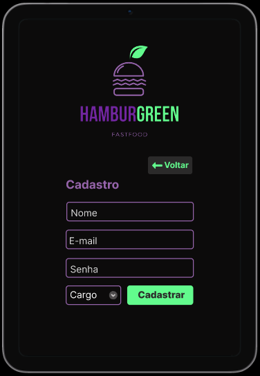
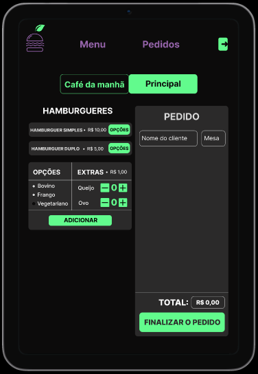
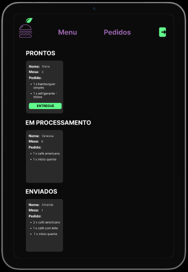
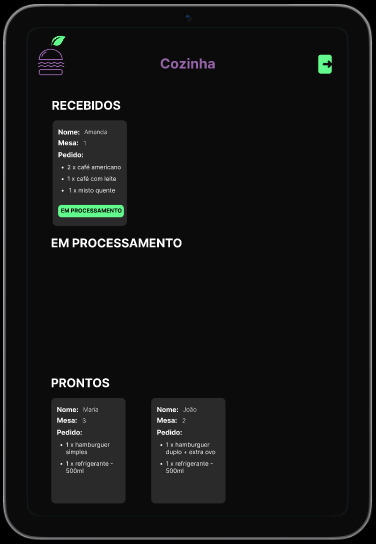

   
  
  # Hamburgreen: sua eco-hamburgueria predileta
  
  

  
  
  
  
   
   
  

   
  
  **Status do Projeto:** _Em andamento_ 

  Confira o resultado do projeto [aqui]() ou no QR code a seguir:

     
  

## Índice

* [1. Resumo do projeto](#1-resumo-do-projeto)
* [2. Definição de produto](#2-definição-de-produto)
* [3. Histórias de usuário](#3-histórias-de-usuário)
* [4. Desenho da Interface de Usuário](#4-desenho-da-interface-de-usuário)
  * [4.1 Protótipo de baixa fidelidade](#41-protótipo-de-baixa-fidelidade)
  * [4.2 Protótipos de alta fidelidade](#42-protótipos-de-alta-fidelidade)
* [5. Testes manuais e de usabilidade](#5-testes-manuais-e-de-usabilidade)
* [6. Considerações Técnicas](#6-considerações-técnicas)
  * [6.1 Boilerplate](#61-boilerplate)
  * [6.2 Planejamento](#62-planejamento)
  * [6.3 Ferramentas utilizadas](#63-ferramentas-utilizadas)
  * [6.4 Tech Skills](#64-tech-skills)
  * [6.5 Objetivos de aprendizagem](#65-objetivos-de-aprendizagem)
  
***

## 1. Resumo do projeto
[React](https://reactjs.org/), [Angular](https://angular.io/) e
[Vue](https://vuejs.org/) são alguns dos _frameworks_ e _bibliotecas_ de
JavaScript mais usados na área de desenvolvimento ao redor do mundo e existe uma
razão para isso. No contexto do navegador, [_manter a interface sincronizada com
o estado é
difícil_](https://medium.com/dailyjs/the-deepest-reason-why-modern-javascript-frameworks-exist-933b86ebc445).
Ao eleger um _framework_ ou _biblioteca_ para nossa interface, nos apoiamos em
uma série de convenções e implementações _testadas_ e _documentadas_ para
resolver um problema comum a toda interface web. Isto nos permite concentrar
melhor (dedicar mais tempo) nas características _específicas_ de nossa
aplicação.

Quando escolhemos uma destas tecnologias não só importamos um pedaço de código
para reusar (o qual já é um grande valor por si só), mas também adotamos uma
**arquitetura**, uma série de **princípios de design**, um paradigma, algumas
**abstrações**, um **vocabulário**, uma **comunidade**, etc...

Como desenvolvedora Front-End, estes kits de desenvolvimento podem resultar em
uma grande ajuda para implementar rapidamente características dos projetos em que
você for trabalhar.

Um pequeno restaurante de hambúrgueres, que está crescendo, necessita uma
interface em que se possa realizar pedidos utilizando um _tablet_, e enviá-los
para a cozinha para que sejam preparados de forma ordenada e eficiente.

Este projeto tem duas áreas: interface (cliente) e API (servidor). Nosso
cliente nos pediu para desenvolver uma interface que se integre com a API.

Desta vez temos um projeto 100% por demanda. Você sempre pode (e deve) fazer
sugestões de melhora e mudança, mas muitas vezes trabalhará em um projeto em que
primeiro deve se assegurar de cumprir os requisitos.

Estas são as informações que temos do cliente:

> Somos **Burger Queen**, um fast food 24hrs.
>
>A nossa proposta de serviço 24 horas foi muito bem recebida e, para continuar a
>crescer, precisamos de um sistema que nos ajude a receber pedidos de nossos
>clientes.
>
>Nós temos 2 menus. Um muito simples para o café da manhã:
>
>| Ítem                      |Preço R$|
>|---------------------------|------|
>| Café americano            |    5 |
>| Café com leite            |    7 |
>| Sanduíche de presunto e queijo|   10 |
>| Suco de fruta natural     |    7 |
>
>E outro menu para o resto do dia:
>
>| Ítem                      |Preço |
>|---------------------------|------|
>|**Hambúrgueres**           |   **R$**   |
>|Hambúrguer simples         |    10|
>|Hambúrguer duplo           |    15|
>|**Acompanhamentos**        |   **R$**   |
>|Batata frita               |     5|
>|Anéis de cebola            |     5|
>|**Bebidas**                |   **R$**   |
>|Água 500ml                 |     5|
>|Água 750ml                 |     7|
>|Bebida gaseificada 500ml   |     7|
>|Bebida gaseificada 750ml   |    10|
>
> **Importante:** Os clientes podem escolher entre hambúrgueres de carne bovina,
> frango ou vegetariano. Além disso, por um adicional de R\$ 1,00 , eles podem
> adicionar queijo **ou** ovo.
>
>Nossos clientes são bastante indecisos, por isso é muito comum que eles mudem o
>seu pedido várias vezes antes de finalizar.

A interface deve mostrar os dois menus (café da manhã e restante do dia), cada
um com todos os seus _produtos_. O usuário deve poder escolher que _produtos_
adicionar e a interface deve mostrar o _resumo do pedido_ com o custo total.

Além disso a cliente nos deu um [link da documentação]( https://lab-api-bq.up.railway.app/api-docs/)
que especifica o comportamento esperado da API que iremos expor por HTTP.
Lá podemos encontrar todos os detalhes dos _endpoints_, como por exemplo
que parâmetros esperam, o que devem responder, etc.

O objetivo principal é aprender a construir uma _interface web_ usando o
_framework_ React. Esses framework front-end ataca
o seguinte problema: **como manter a interface e estado sincronizados**.
Portanto, esta experiência espera familiarizá-la com o conceito de _estado da
tela_, e como cada mudança no estado vai refletir na interface (por exemplo,
toda vez que adicionamos um _produto_ para um _pedido_, a interface deve
atualizar a lista de pedidos e o total).

## 2. Definição de produto

Imagina comer um lanche delicioso em uma hamburgueria que utiliza: fontes de energias 100% limpa, material 100% sustentável e que todo o lixo gerado é reciclado? Seu sonho virou realidade. A  Hamburgreen é a sua eco-hamburgueria predileta! Nossa empresa é 100% eco-friendly, pensada na sustentabilidade do planeta e construída para fazer não somente você feliz, mas a nossa natureza também.

Aqui a energia utilizada vem de usinas solares e de biogás do Piauí, os materiais utilizáveis são todos recicláveis e todo o lixo gerado é separado de acordo com as normas de reciclagem e enviado para os locais de reciclagem corretamente.

## 3. Histórias de Usuário

### Definição do produto

O [_Product Owner_](https://www.youtube.com/watch?v=7lhnYbmovb4) nos apresentou
este _backlog_ que é o resultado do seu trabalho com o cliente até hoje.

***

#### [História de usuário 1] Garçom/Garçonete deve poder entrar no sistema

Eu, como garçom/garçonete quero entrar no sistema de pedidos.

##### Critérios de aceitação

O que deve acontecer para satisfazer as necessidades do usuário?

* Acessar uma tela de login.
* Inserir email e senha.
* Receber mensagens de erros compreensíveis, conforme o erro e as informações inseridas.
* Entrar no sistema de pedidos caso as credenciais forem corretas.

##### Definição de pronto

O acordado abaixo deve acontecer para dizer que a história está terminada:

* Você deve ter recebido _code review_ de pelo menos uma parceira.
* Fez _testes_ unitários e, além disso, testou seu produto manualmente.
* Você fez _testes_ de usabilidade e incorporou o _feedback_ do usuário.
* Você deu deploy de seu aplicativo e marcou sua versão (tag git).

***

#### [História de usuário 2] Garçom/Garçonete deve ser capaz de anotar o pedido do cliente

Eu como garçom/garçonete quero poder anotar o pedido de um cliente para não
depender da minha memória, saber quanto cobrar e poder enviar os pedidos para a
cozinha para serem preparados em ordem.

##### Critérios de aceitação

O que deve acontecer para satisfazer as necessidades do usuário?

* Anotar o nome do cliente.
* Adicionar produtos aos pedidos.
* Excluir produtos.
* Ver resumo e o total da compra.
* Enviar o pedido para a cozinha (guardar em algum banco de dados).
* Funcionar bem em um _tablet_.

##### Definição de pronto

O acordado abaixo deve acontecer para dizer que a história está terminada:

* Você deve ter recebido _code review_ de pelo menos uma parceira.
* Fez _testes_ unitários e, além disso, testou seu produto manualmente.
* Você fez _testes_ de usabilidade e incorporou o _feedback_ do usuário.
* Você deu deploy de seu aplicativo e marcou sua versão (tag git).

***

#### [História de usuário 3] Chefe de cozinha deve ver os pedidos

Eu como chefe de cozinha quero ver os pedidos dos clientes em ordem, poder
marcar que estão prontos e poder notificar os garçons/garçonetes que o pedido
está pronto para ser entregue ao cliente.

##### Critérios de aceitação

* Ver os pedidos ordenados à medida em que são feitos.
* Marcar os pedidos que foram preparados e estão prontos para serem servidos.
* Ver o tempo que levou para preparar o pedido desde que chegou, até ser marcado
  como concluído.

##### Definição de pronto

* Você deve ter recebido _code review_ de pelo menos uma parceira.
* Fez _testes_ unitários e, além disso, testou seu produto manualmente.
* Você fez _testes_ de usabilidade e incorporou o _feedback_ do usuário.
* Você deu deploy de seu aplicativo e marcou sua versão (tag git).

***

#### [História de usuário 4] Garçom/Garçonete deve ver os pedidos prontos para servir

Eu como garçom/garçonete quero ver os pedidos que estão prontos para entregá-los
rapidamente aos clientes.

##### Critérios de aceitação

* Ver a lista de pedidos prontos para servir.
* Marcar os pedidos que foram entregues.

##### Definição de pronto

* Você deve ter recebido _code review_ de pelo menos uma parceira.
* Fez _testes_ unitários e, além disso, testou seu produto manualmente.
* Você fez _testes_ de usabilidade e incorporou o _feedback_ do usuário.
* Você deu deploy de seu aplicativo e marcou sua versão (tag git).
* Os dados devem ser mantidos intactos, mesmo depois que um pedido for
  finalizado. Tudo isso para poder ter estatísticas no futuro.

***

## 4. Desenho da Interface de Usuário

O protótipo de alta fidelidade foi construído utilizando a ferramenta Figma. Você pode conferí-lo inteiramente [aqui](https://www.figma.com/proto/DcySoXGhWAKQHVPEA2hLVY/Burguer-Queen?node-id=23%3A5&scaling=scale-down&page-id=23%3A4&starting-point-node-id=23%3A5).

## 5. Testes manuais e de usabilidade
## 6. Considerações Técnicas
### 6.1 Boilerplate
### 6.2 Planejamento
### 6.3 Ferramentas utilizadas
### 6.4 Tech Skills
### 6.5 Objetivos de aprendizagem

